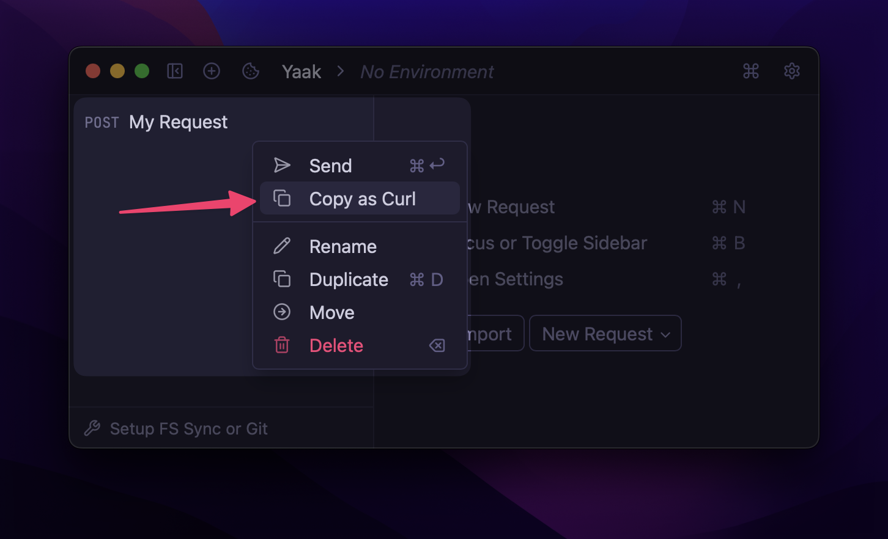

# Copy as cUrl

A request action plugin for Yaak that converts HTTP requests into [curl](https://curl.se)
commands, making it easy to share, debug, and execute requests outside Yaak.



## Overview

This plugin adds a 'Copy as Curl' action to HTTP requests, converting any request into its
equivalent curl command. This is useful for debugging, sharing requests with team members,
and executing requests in terminal environments where `curl` is available.

## How It Works

The plugin analyzes the given HTTP request and generates a properly formatted curl command
that includes:

- HTTP method (GET, POST, PUT, DELETE, etc.)
- Request URL with query parameters
- Headers (including authentication headers)
- Request body (for POST, PUT, PATCH requests)
- Authentication credentials

## Usage

1. Configure an HTTP request as usual in Yaak
2. Right-click on the request in the sidebar
3. Select 'Copy as Curl'
4. The command is copied to your clipboard
5. Share or execute the command

## Generated Curl Examples

### Simple GET Request

```bash
curl -X GET 'https://api.example.com/users' \
  --header 'Accept: application/json'
```

### POST Request with JSON Data

```bash
curl -X POST 'https://api.example.com/users' \
  --header 'Content-Type: application/json' \
  --header 'Accept: application/json' \
  --data '{
    "name": "John Doe",
    "email": "john@example.com"
  }'
```

### Request with Multi-part Form Data

```bash
curl -X POST 'yaak.app' \
  --header 'Content-Type: multipart/form-data' \
  --form 'hello=world' \
  --form file=@/path/to/file.json
```

### Request with Authentication

```bash
curl -X GET 'https://api.example.com/protected' \
  --user 'username:password'
```
