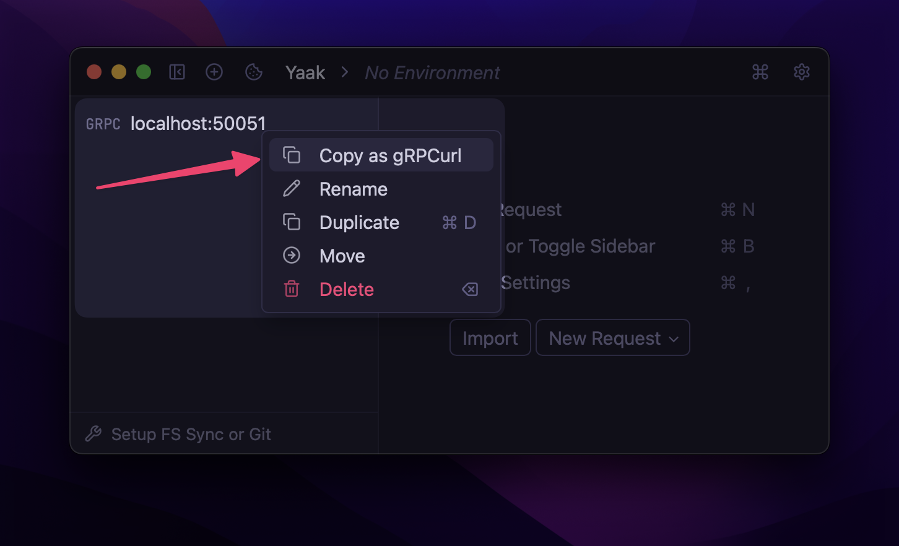

# Copy as gRPCurl

An HTTP request action plugin that converts gRPC requests
into [gRPCurl](https://github.com/fullstorydev/grpcurl) commands, enabling easy sharing,
debugging, and execution of gRPC calls outside Yaak.



## Overview

This plugin adds a "Copy as gRPCurl" action to gRPC requests, converting any gRPC request
into its equivalent executable command. This is useful for debugging gRPC services,
sharing requests with team members, or executing gRPC calls in terminal environments where
`grpcurl` is available.

## How It Works

The plugin analyzes your gRPC request configuration and generates a properly formatted
`grpcurl` command that includes:

- gRPC service and method names
- Server address and port
- Request message data (JSON format)
- Metadata (headers)
- Authentication credentials
- Protocol buffer definitions

## Usage

1. Configure a gRPC request as usual in Yaak
2. Right-click on the request sidebar item
3. Select "Copy as gRPCurl" from the available actions
4. The command is copied to your clipboard
5. Share or execute the command

## Generated gRPCurl Examples

### Simple Unary Call


```bash
grpcurl -plaintext \
  -d '{"name": "John Doe"}' \
  localhost:9090 \
  user.UserService/GetUser
```

### Call with Metadata

```bash
grpcurl -plaintext \
  -H "authorization: Bearer my-token" \
  -H "x-api-version: v1" \
  -d '{"user_id": "12345"}' \
  api.example.com:443 \
  user.UserService/GetUserProfile
```

### Call with TLS

```bash
grpcurl \
  -d '{"query": "search term"}' \
  secure-api.example.com:443 \
  search.SearchService/Search
```

### Call with Proto Files

```bash
grpcurl -import-path /path/to/protos \
  -proto /other/path/to/user.proto \
  -d '{"email": "user@example.com"}' \
  localhost:9090 \
  user.UserService/CreateUser
```
