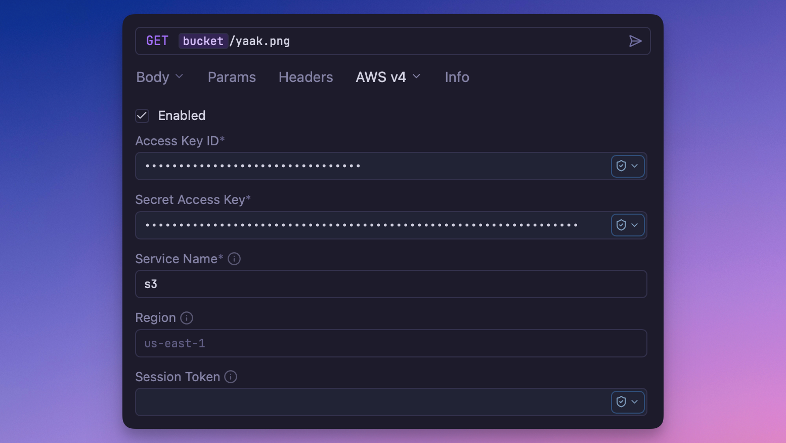

# AWS Signature Version 4 Auth

A plugin for authenticating AWS-compatible requests using the
[AWS Signature Version 4 signing process](https://docs.aws.amazon.com/general/latest/gr/signature-version-4.html).  
This enables secure, signed requests to AWS services (or any S3-compatible APIs like
Cloudflare R2).



## Overview

This plugin provides AWS Signature authentication for API requests in Yaak. SigV4 is used
by nearly all AWS APIs to verify the authenticity and integrity of requests using
cryptographic signatures.

With this plugin, you can securely sign requests to AWS services such as S3, STS, Lambda,
API Gateway, DynamoDB, and more. You can also authenticate against S3-compatible services
like **Cloudflare R2**, **MinIO**, or **Wasabi**.

## How AWS Signature Version 4 Works

SigV4 signs requests by creating a hash of key request components (method, URL, headers,
and optionally the payload) using your AWS credentials. The resulting HMAC signature is
added in the `Authorization` header along with credential scope metadata.

Example header:

```
Authorization: AWS4-HMAC-SHA256 Credential=AKIA…/20251011/us-east-1/s3/aws4_request, SignedHeaders=host;x-amz-date, Signature=abcdef123456…
```

Each request must include a timestamp (`X-Amz-Date`) and may include a session token if
using temporary credentials.

## Configuration

The plugin presents the following fields:

- **Access Key ID** – Your AWS access key identifier
- **Secret Access Key** – The secret associated with the access key
- **Session Token** *(optional)* – Used for temporary or assumed-role credentials (treated as secret)
- **Region** – AWS region (e.g., `us-east-1`)
- **Service** – AWS service identifier (e.g., `sts`, `s3`, `execute-api`)

## Usage

1. Configure a request, folder, or workspace to use **AWS SigV4 Authentication**
2. Enter your AWS credentials and target service/region
3. The plugin will automatically sign outgoing requests with valid SigV4 headers
