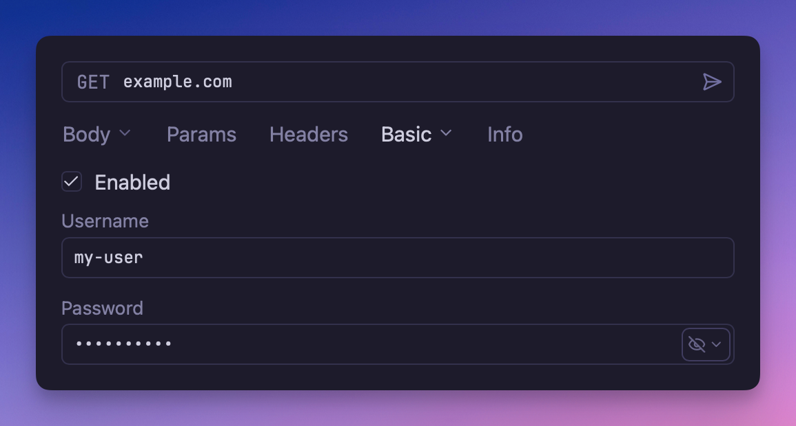

# Basic Authentication 

A simple Basic Authentication plugin that implements HTTP Basic Auth according
to [RFC 7617](https://datatracker.ietf.org/doc/html/rfc7617), enabling secure
authentication with username and password credentials.



## Overview

This plugin provides HTTP Basic Authentication support for API requests in Yaak. Basic
Auth is one of the most widely supported authentication methods, making it ideal for APIs
that require simple username/password authentication without the complexity of OAuth
flows.

## How Basic Authentication Works

Basic Authentication encodes your username and password credentials using Base64 encoding
and sends them in the `Authorization` header with each request. The format is:

```
Authorization: Basic <base64-encoded-credentials>
```

Where `<base64-encoded-credentials>` is the Base64 encoding of `username:password`.

## Configuration

The plugin presents two fields:

- **Username**: Username or user identifier
- **Password**: Password or authentication token

## Usage

1. Configure the request, folder, or workspace to use Basic Authentication
2. Enter your username and password in the authentication configuration
3. The plugin will automatically add the proper `Authorization` header to your requests

## Troubleshooting

- **401 Unauthorized**: Verify your username and password are correct
- **403 Forbidden**: Check if your account has the necessary permissions
- **Connection Issues**: Ensure you're using HTTPS for secure transmission
