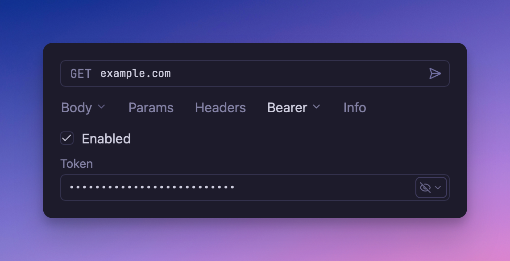

# Bearer Token Authentication Plugin

A Bearer Token authentication plugin for Yaak that
implements [RFC 6750](https://datatracker.ietf.org/doc/html/rfc6750), enabling secure API
access using tokens, API keys, and other bearer credentials.



## Overview

This plugin provides Bearer Token authentication support for your API requests in Yaak.
Bearer Token authentication is widely used in modern APIs, especially those following REST
principles and OAuth 2.0 standards. It's the preferred method for APIs that issue access
tokens, API keys, or other bearer credentials.

## How Bearer Token Authentication Works

Bearer Token authentication sends your token in the `Authorization` header with each
request using the Bearer scheme:

```
Authorization: Bearer <your-token>
```

The token is transmitted as-is without any additional encoding, making it simple and
efficient for API authentication.

## Configuration

The plugin requires only one field:

- **Token**: Your bearer token, access token, API key, or other credential
- **Prefix**: The prefix to use for the Authorization header, which will be of the
  format "<PREFIX> <TOKEN>"

## Usage

1. Configure the request, folder, or workspace to use Bearer Authentication
2. Enter the token and optional prefix in the authentication configuration
3. The plugin will automatically add the proper `Authorization` header to your requests

## Troubleshooting

- **401 Unauthorized**: Verify your token is valid and not expired
- **403 Forbidden**: Check if your token has the necessary permissions/scopes
- **Invalid Token Format**: Ensure you're using the complete token without truncation
- **Token Expiration**: Refresh or regenerate expired tokens
