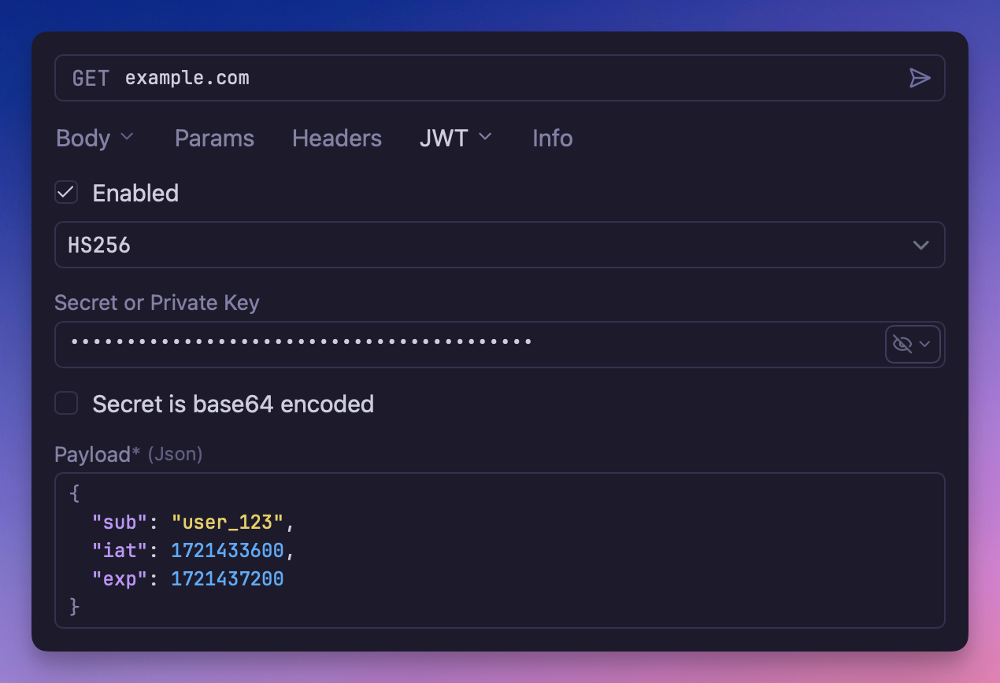

# JSON Web Token (JWT) Authentication

A [JSON Web Token](https://datatracker.ietf.org/doc/html/rfc7519) (JWT) authentication
plugin that supports token generation, signing, and automatic header management.



## Overview

This plugin provides JWT authentication support for API requests. JWT is a compact,
URL-safe means of representing claims between two parties, commonly used for
authentication and information exchange in modern web applications and APIs.

## How JWT Authentication Works

JWT authentication involves creating a signed token containing claims about the user or
application. The token is sent in the `Authorization` header:

```
Authorization: Bearer <jwt-token>
```

A JWT consists of three parts separated by dots:

- **Header**: Contains the token type and signing algorithm
- **Payload**: Contains the claims (user data, permissions, expiration, etc.)
- **Signature**: Ensures the token hasn't been tampered with

## Usage

1. Configure the request, folder, or workspace to use JWT Authentication
2. Set up your signing algorithm and secret/key
3. Configure the required claims for your JWT
4. The plugin will generate, sign, and include the JWT in your requests

## Common Use Cases

JWT authentication is commonly used for:

- **Microservices Authentication**: Service-to-service communication
- **API Gateway Integration**: Authenticating with API gateways
- **Single Sign-On (SSO)**: Sharing authentication across applications
- **Stateless Authentication**: No server-side session storage required
- **Mobile App APIs**: Secure authentication for mobile applications
- **Third-party Integrations**: Authenticating with external services

## Troubleshooting

- **Invalid Signature**: Check your secret/key and algorithm configuration
- **Token Expired**: Verify expiration time settings
- **Invalid Claims**: Ensure required claims are properly configured
- **Algorithm Mismatch**: Verify the algorithm matches what the API expects
- **Key Format Issues**: Ensure RSA keys are in the correct PEM format
