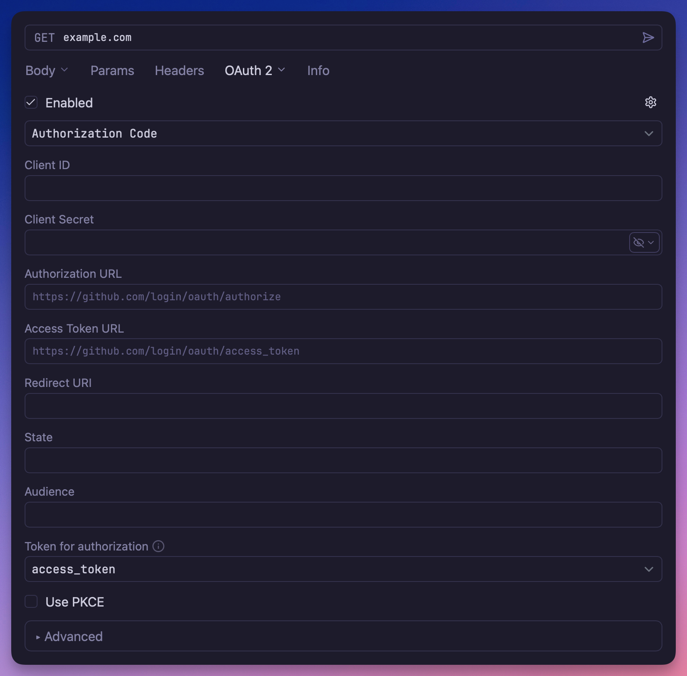

# OAuth 2.0 Authentication

An [OAuth 2.0](https://datatracker.ietf.org/doc/html/rfc6749) authentication plugin that
supports multiple grant types and flows, enabling secure API authentication with OAuth 2.0
providers.

## Overview

This plugin implements OAuth 2.0 authentication for requests, supporting the most common
OAuth 2.0 grant types used in modern API integrations. It handles token management,
automatic refresh, and [PKCE](https://datatracker.ietf.org/doc/html/rfc7636) (Proof Key
for Code Exchange) for enhanced security.

## Supported Grant Types

### Authorization Code Flow

The most secure and commonly used OAuth 2.0 flow for web applications.

- Standard Authorization Code flow
- Optional PKCE (Proof Key for Code Exchange) for enhanced security
- Supports automatic token refresh

### Client Credentials Flow

Ideal for server-to-server authentication where no user interaction is required. 

### Implicit Flow

Legacy flow for single-page applications (deprecated but still supported):

- Direct access token retrieval
- No refresh token support
- Suitable for legacy integrations

### Resource Owner Password Credentials Flow

Direct username/password authentication.

- User credentials are exchanged directly for tokens
- Should only be used with trusted applications
- Supports automatic token refresh

## Features

- **Automatic Token Management**: Handles token storage, expiration, and refresh
  automatically
- **PKCE Support**: Enhanced security for Authorization Code flow
- **Token Persistence**: Stores tokens between sessions
- **Flexible Configuration**: Supports custom authorization and token endpoints
- **Scope Management**: Configure required OAuth scopes for your API
- **Error Handling**: Comprehensive error handling and user feedback

## Usage

1. Configure the request, folder, or workspace to use OAuth 2.0 Authentication
2. Select the appropriate grant type for your use case
3. Fill in the required OAuth 2.0 parameters from your API provider
4. The plugin will handle the authentication flow and token management automatically

## Compatibility

This plugin is compatible with OAuth 2.0 providers including:

- Google APIs
- Microsoft Graph
- GitHub API
- Auth0
- Okta
- And many other OAuth 2.0 compliant services
