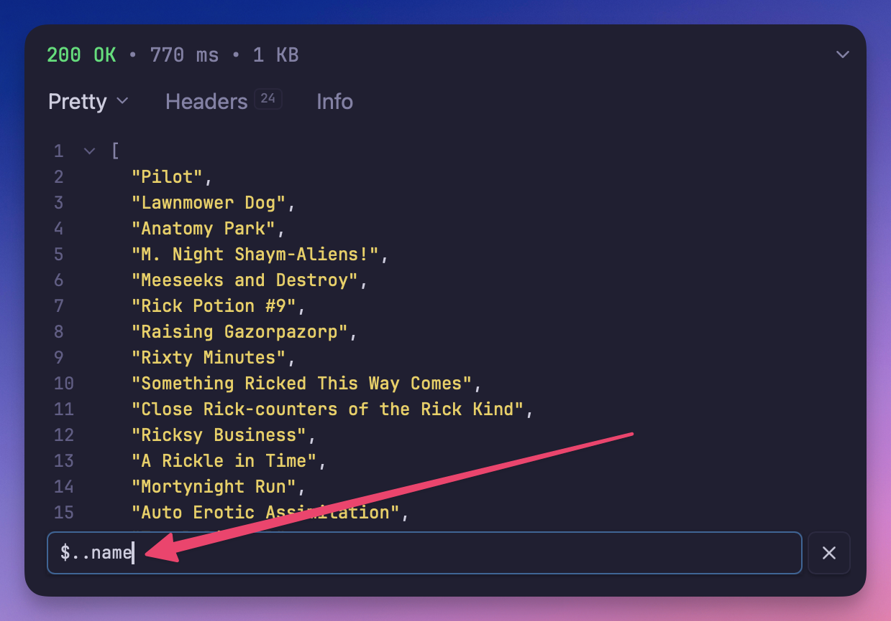

# JSONPath

A filter plugin that enables [JSONPath](https://en.wikipedia.org/wiki/JSONPath)
extraction and filtering for JSON responses, making it easy to extract specific values
from complex JSON structures.



## Overview

This plugin provides JSONPath filtering for responses in Yaak. JSONPath is a query
language for JSON, similar to XPath for XML, that provides the ability to extract data
from JSON documents using a simple, expressive syntax. This is useful for working with
complex API responses where you need to only view a small subset of response data.

## How JSONPath Works

JSONPath uses a dot-notation syntax to navigate JSON structures:

- `$` - Root element
- `.` - Child element
- `..` - Recursive descent
- `*` - Wildcard
- `[]` - Array index or filter

## JSONPath Syntax Examples

### Basic Navigation

```
$.store.book[0].title          # First book title
$.store.book[*].author         # All book authors
$.store.book[-1]               # Last book
$.store.book[0,1]              # First two books
$.store.book[0:2]              # First two books (slice)
```

### Filtering

```
$.store.book[?(@.price < 10)]           # Books under $10
$.store.book[?(@.author == 'Tolkien')]  # Books by Tolkien
$.store.book[?(@.category == 'fiction')] # Fiction books
```

### Recursive Search

```
$..author                      # All authors anywhere in the document
$..book[2]                     # Third book anywhere
$..price                       # All prices in the document
```

## Usage

1. Make an API request that returns JSON data
2. Below the response body, click the filter icon
3. Enter a JSONPath expression
4. View the extracted data in the results panel
